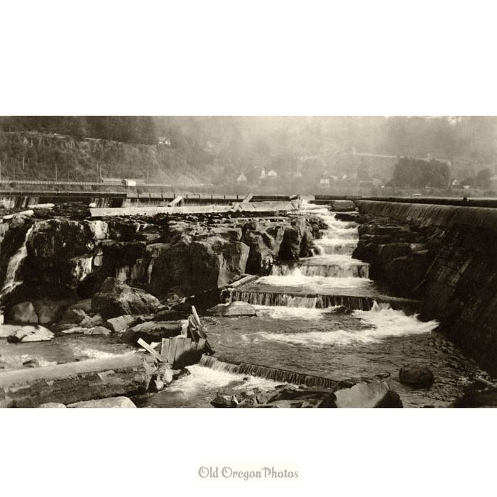

## Overview {.tabset}

**Summary:**
The Columbia River Data Access in Real Time [(DART)](http://www.cbr.washington.edu/dart/query/adult_daily) program is part of the University of Washington's Columbia Basin Research program. DART provides access to various environmental, riparian, and oceanic data, including salmonid-specific observations. This report utilizes DART data to explore adult fish passage from 2001 - 2010 at the Willamette Falls fish ladder on the Willamette River (Image 1). Included in the report are visualizations of various time series, seasonal patterns of fish observations, and annual fish species counts.

**Image 1:** Willamette Falls Fish Ladder, circa 1913
**Source:** [Old Oregon Photos](https://www.oldoregonphotos.com/fish-ladder-at-willamette-falls-1913.html)


```{r setup, include=FALSE}
knitr::opts_chunk$set(echo = TRUE, message = FALSE, warning = FALSE)
# Attach packages and read in and tidy data 

library(tidyverse)
library(janitor)
library(here)
library(lubridate)
library(tsibble)
library(feasts)
library(viridis)


willamette_fish_passage <- read_csv(here("data", "willamette_fish_passage.csv")) %>% 
  clean_names() %>% 
  select(coho, jack_coho, steelhead, date) %>% 
  mutate(date = lubridate::mdy(date))

# converting to long format to put all fish species in one column
willamette_long <- willamette_fish_passage %>% 
  pivot_longer(1:3,
               names_to = "fish_species",
               names_prefix = NULL,
               values_drop_na = FALSE) # decided not to drop observations with n/a values becuase in Tab 1 it says to change na values to zero
  # replace na values with zero
willamette_long[is.na(willamette_long)] = 0 

```


### **Tab 1:** Original time series 

```{r}

# Time series- tsibble

willamette_ts <- willamette_long %>% 
   as_tsibble(key = fish_species, index = date) # not sure if key should be fish species or something else? 

ggplot (data = willamette_ts, aes(x = date, y = value))+
  geom_line()+
  labs(x = "Date", y = "Fish Count", title = "Fish counts at Willamette Falls (2001 - 2010)", subtitle = "Adult passage (fish/day)",
       caption = "Figure 1: Time series of Coho, Jack coho, and steelhead salmon passage from 2001 - 2010 (fish/ day)")+
  facet_wrap(~fish_species, nrow = 3, 
             labeller = labeller(fish_species =
                                   c("coho" = "Coho",
                                   "jack_coho" = "Jack Coho",
                                   "steelhead" = "Steehead")))+
  theme_classic()

```
<br>

- There is a linear and seasonal trend for Coho. Between 2002 and 2010 the adult passage in fish per day for Coho has increased.

- Jack Coho experiences a seasonal trend, but adult passage for Jack Coho is less successful than for Coho or Steelhead.

- Steelhead experiences seasonal patterns

### **Tab 2:** Seasonplots
 
```{r}
#Wrangle data for use in seasonplot
willamette_ts_season <- willamette_long %>% 
   as_tsibble(key = fish_species, index = date)

#Create color-blind friendly color palette (from r-cookbook)
cbPalette <- c("#999999", "#E69F00", "#56B4E9", "#009E73", "#F0E442", "#0072B2", "#D55E00", "#CC79A7", "#c71585", "#458b74")

#Create Seasonplot
willamette_ts_season %>% 
  gg_season(y = value) + 
  facet_wrap(~ fish_species,   #make a different plot for each fish species
             scales = "fixed") +   #fix the y axis 
  labs(title = "Seasonal Variation in Williamette Falls salmon passage",
       x = "Month",
       y = "Count",
       caption = "Figure 2: Coho, Jack coho, and steelhead salmon passage from 2001 - 2010 ",
       color = "Year") +  #label the legend
  theme_classic() +
  scale_fill_continuous(
                      breaks = c("2001", "2002", "2003", "2004", "2005", "2006", "2007", "2008", "2009", "2010"),
                      labels = c("2001", "2002", "2003", "2004", "2005", "2006", "2007", "2008", "2009", "2010")) +
  theme(legend.position = "right") +
  scale_fill_viridis_c() 
```
<br>

- Coho salmon's highest seasonal peak was in 2010.

- Coho and jack-coho experience peaks in October, while Steelhead salmon experience peaks in June. 

- Steelhead salmon have a longer passage period than coho and jack-coho


### **Tab 3:** Annual counts by species

```{r}


# summarize count by species and year
fish_year <- willamette_long %>% 
  mutate(year = year(date))  %>% # pulling just the year from the date
  replace_na() %>% 
  group_by(year, fish_species) %>% 
  summarize(annual_total = sum(value))
  
# graphing fish passage by species and year
ggplot(data = fish_year,
       aes(x = year,
           y = annual_total)) +
  geom_line(aes(color = fish_species)) +
  scale_x_continuous(expand = c(0,0),
                     breaks = seq(2001,2010,1)) +
  scale_y_continuous(expand = c(0,0)) +
  labs(x = "Year",
       y = "Annual observed",
       title = "Annual fish passage totals by species (2001-2010)",
       caption = "Figure 3: Annual fish passage totals for Coho, Jack Coho, and Steelhead  passage from 2001 - 2010 ",
      fill = "Fish species") +
  theme(plot.title = element_text(hjust = -1)) +
  theme(axis.text.x = element_text(angle = 45, hjust = 1, vjust = 0.5 )) +
  theme_classic() +
  scale_color_discrete(name = "Fish species", 
                       breaks = c("coho", "jack_coho", "steelhead"),
                       labels = c("Coho", "Jack Coho", "Steelhead")) 

#scale_color_manual(values = cbPalette) 

# edited legend labels from http://www.cookbook-r.com/Graphs/Legends_(ggplot2)/

```
Summary statistics and analysis: major trends

- Steelhead experienced a general decline in annual observed fish passage from 2001 -2009, with a sharp increase in passage in 2010. More data would be need to know if 2010 indicates a change in negative trend or if passage will generally continue to decline.
- Coho and Jack Coho fish passage observations were signifantly lower than Steelhead from 2001 - 2008. In 2009, Coho passage increased sixfold to surpass Steelhead observations for that year, while Jack Coho counts stayed constant.

